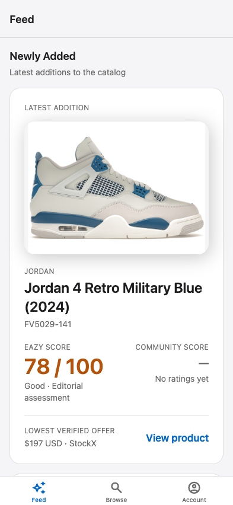

# Eazy Review

An independent engineering project: a mobile-first sneaker review app for discovering
products, comparing **Eazy Score** with **Community Score**, and keeping a personal
**My Rating**.

[Development guide](docs/DEVELOPMENT.md) · [Build journal](https://lab.tianzhe.me/) · [Project board](https://github.com/users/tyson-hu/projects/4)

## What exists

- Public Feed, Browse and Product Detail backed by Supabase/PostgreSQL.
  Feed highlights Newly Added, Best Eazy Scores, Most Rated when enough products
  have ratings, and published curated collections.
- Email/password accounts, personal ratings across ten sneaker dimensions,
  server-derived Community Score, and Rated Products history.
- Local/development password recovery through app deep links and protected
  account deletion with recorded human acceptance.
- Offline, reconnect, timeout and backend-unreachable feedback. Failed rating
  writes preserve form input for manual retry; there is no durable offline cache
  or write queue.

Feed was human accepted in [PR #52](https://github.com/tyson-hu/Eazy-Review/pull/52).
Production setup and release readiness remain separate work; see the
[task ledger](docs/TASKS.md) and [release checklist](docs/RELEASE_CHECKLIST.md).
The build journal documents the project; it is not a hosted app demo.

## Preview



Actual mobile web preview against the local catalog, captured September 3, 2026.
This image demonstrates the Feed layout; it does not establish native or
physical-device behavior. [Preview evidence](docs/evidence/task-21-real-feed-mvp/RESULT.md).

## Stack

Expo SDK 57, React Native, Expo Router, TypeScript and NativeWind provide the
mobile UI. TanStack Query and NetInfo manage connected requests. Supabase
provides authentication and PostgreSQL, with row-level security and
server-derived rating aggregates. [package.json](package.json) owns versions.

## Engineering Evidence

- Least-privilege grants, owner-scoped RLS, server-derived scores, and
  concurrency behavior: [data model and authorization contract](docs/DATA_MODEL.md)
  and [Tasks 11–12 database acceptance](docs/evidence/task-11-12-database-acceptance/RESULT.md).
- Catalog and rating failure handling, including physical-device offline and
  reconnect checks: [connected-request reliability decision](docs/decisions/2026-08-09-connected-request-reliability.md),
  [Task 15 evidence](docs/evidence/task-15-public-catalog/RESULT.md), and
  [Task 17 evidence](docs/evidence/task-17-my-rating-persistence/RESULT.md).
- Authentication, session restoration, and password recovery:
  [Task 16 evidence](docs/evidence/task-16-auth-account/RESULT.md) and
  [Task 18 evidence](docs/evidence/task-18-password-recovery/RESULT.md).
- Protected account-deletion boundary, local orchestration, and human
  acceptance evidence:
  [Task 19 evidence](docs/evidence/task-19-protected-account-deletion/RESULT.md).
- Automated frontend, database, security, and concurrency gates:
  [Expo CI](.github/workflows/expo-ci.yml) and
  [Database CI](.github/workflows/database-ci.yml).

## Run locally

Use Node.js 24 and npm `>=11.16.0 <12` (CI pins `11.17.0`), Docker Desktop
and the Supabase CLI. Review the [install rules](docs/SECURITY.md#install-and-setup-scripts)
before running setup:

```bash
npm ci
test -e .env || cp .env.example .env
supabase start
```

Set `.env` to the local Supabase URL and publishable/legacy anon key from your
local instance. The example values intentionally do not connect. Follow the
[local database setup](docs/DEVELOPMENT.md#local-supabase) to seed the disposable
development database, then use `npm run web` or the
[iPhone development-build guide](docs/DEVELOPMENT.md#physical-iphone-development-and-offline-testing).
Never put a service-role key in the app bundle or share environment files.

## Quality and contribution

After reviewing executable inputs, use `npm run check:readonly` for the
read-only repository gate and `npm test` for frontend tests. The full Expo
gate is `npm run check:expo`; database and Edge Function changes have their
own checks. Follow the [validation map](docs/AGENT_WORKFLOW.md#validation)
to select affected checks. Automation does not replace human or device acceptance.

Start with [Contributing](CONTRIBUTING.md), [Support](SUPPORT.md), and the
[Code of Conduct](CODE_OF_CONDUCT.md). Report vulnerabilities through the
[security policy](docs/SECURITY.md), not public issues.

Product scope lives in [BLUEBOOK](docs/BLUEBOOK.md), UI decisions in
[DESIGN](docs/DESIGN.md), and frontend boundaries in
[API contracts](docs/API_CONTRACTS.md). [AGENTS.md](AGENTS.md) routes coding
agents to the relevant contracts; [documentation policy](docs/DOCUMENTATION_POLICY.md)
owns documentation updates.

Licensed under [MIT](LICENSE).
