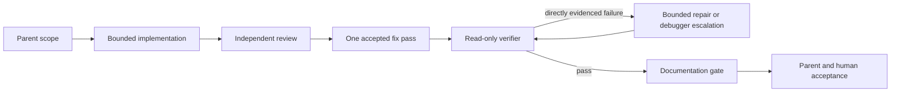

# Agent Workflow

This is the canonical process doc for working in this repo: how a session starts, what to read for each task type, what "done" means, and the exact handoff and PR summary formats. `AGENTS.md` holds the compact version; this file holds the authoritative detail. Loop mechanics (stop conditions, retries, memory) live in `docs/LOOP_ENGINEERING.md`.

## Session Flow

Every working session follows the same three steps:

1. Run `git status --short`. Do not overwrite unrelated uncommitted changes.
2. Read the current task in `docs/TASKS.md`.
3. Select the matching route from the loop index in
   `docs/LOOP_ENGINEERING.md`: follow the named `skills/<name>/SKILL.md`
   routine, or use its explicit no-skill workflow.

If no skill matches, use the explicit value "None — follow the canonical
workflow and task contract"; work directly while still applying the context
map, definition of done, and handoff format below.

When continuing work from a previous session: read `AGENTS.md`, the spec, and `docs/notes/handoff.md` (plus any linked `docs/notes/blocker-*.md`), then restate the plan before editing anything.

### Decision lookup

Do not read every decision record:

1. Read the generated `docs/DECISIONS.md` index.
2. Match the current task number or area.
3. Open only the linked records relevant to the work.
4. Search superseded records or the legacy archive only when historical reasoning is needed.

Recording rules, statuses, and search examples live in `docs/decisions/README.md`.

## Session Boundaries And State Persistence

Chat is the workbench; files are the hard drive. For long tasks, loops, and cross-day collaboration, state must never live only in chat — `docs/notes/handoff.md`, `docs/notes/blocker-*.md`, `docs/TASKS.md`, and PR checklists are the external state the next session reads, not old transcripts. GitHub Project #4 is a derived public mirror of `docs/TASKS.md`, never the state a session resumes from (`docs/DOCUMENTATION_POLICY.md`, GitHub Project #4 Mirror).

Tell the user it is time to switch to a new session when:

- A feature phase is complete.
- A bug is fixed and the next task is unrelated.
- Backend work is done and the next work is UI.
- Exploration is done and implementation is next.
- The session is overloaded: context is noisy, answered questions get re-asked, or corrected mistakes come back.

At a boundary, stop adding work. Whether the user asks for a handoff or the agent proposes one, run `skills/session-handoff` to write `docs/notes/handoff.md`, then hand the user this resume prompt for the new session:

```txt
Read AGENTS.md, the spec, and docs/notes/handoff.md.
Continue from the previous session, but restate the plan before editing.
```

When debugging stalls instead (2+ failures on the same problem, 20–30+ minutes without progress, or plan A → B → A looping), run `skills/blocker-note` to write `docs/notes/blocker-<topic>.md` and stop attempting fixes in that session.

## Context Map

Read only what the task type needs. Do not read `docs/BLUEBOOK.md` "before any work" — read it only when product scope or direction is actually in question.

| Task type | Read | Do not read |
| --- | --- | --- |
| Build or redesign one screen's UI | `docs/DESIGN.md` (Visual System, Component Rules, and that screen's section in Screen-Level Rules), `docs/USER_FLOWS.md` (that screen's flow) | `docs/BLUEBOOK.md`, `docs/DATA_MODEL.md`, `docs/research/*` |
| Feature slice spanning data + UI (a `docs/TASKS.md` task) | The task in `docs/TASKS.md`, `docs/USER_FLOWS.md` (relevant flow), `docs/API_CONTRACTS.md` (types and functions), `docs/DESIGN.md` (component rules for its screens); for Tasks 15–19, also read the task-specific data, security, and tool-policy documents required by `skills/feature-slice-builder` | `docs/BLUEBOOK.md` |
| Schema, Supabase, RLS, migrations, rating summaries | `docs/DATA_MODEL.md`, `docs/API_CONTRACTS.md` (affected contracts) | `docs/DESIGN.md`, `docs/STITCH_PROMPTS.md` |
| Frontend data shape, types, mock data, folder structure | `docs/API_CONTRACTS.md`; `docs/DATA_MODEL.md` only if a database contract changes | `docs/DESIGN.md` screen sections, `docs/BLUEBOOK.md` |
| Bug fix | User-visible: the affected flow in `docs/USER_FLOWS.md` plus the layer contract. Database/tooling/CI/config/command: the affected canonical contract plus Validation Commands below. | Unrelated product flows or layer docs |
| Refactor (no behavior change) | `docs/API_CONTRACTS.md` (folder structure and contracts covering the moved code) | Product and design docs |
| Docs sync after code drift | `docs/DOCUMENTATION_POLICY.md` (Document Update Map) | Docs the change does not affect |
| Validation / check run | Validation Commands section below in this file | Product docs |
| Interactive mobile simulator walk or iOS screenshot evidence | `skills/interactive-preview-loop`, `docs/MOBILE_SIMULATOR_SOP.md`, `docs/evidence/README.md` | Installing ad-hoc browser automation deps; writing evidence under `docs/notes/` |
| Interactive Expo web mobile preview or Playwright MCP journey | `skills/interactive-preview-loop`, `docs/WEB_MOBILE_PREVIEW_SOP.md`, `docs/MCP_WORKFLOW.md` (tool policy) | Treating web-only as full iOS acceptance |
| UX screenshot audit / readiness gate (baseline → findings → triage) | `skills/interactive-preview-loop`, `docs/UX_SCREENSHOT_AUDIT_SOP.md`, `docs/EVIDENCE_GITHUB_UPLOAD_SOP.md` | Feature implementation packets before triage; product edits during the audit |
| Product scope or direction change | `docs/BLUEBOOK.md`, `docs/ROADMAP.md` | — |
| Stitch, MCP, or external-tool workflow | `docs/MCP_WORKFLOW.md`, `docs/STITCH_PROMPTS.md` | `docs/DATA_MODEL.md` |
| Expo / Expo Router / React Native specifics | Installed versions in `package.json`, plus the exact Expo SDK 57 docs at `https://docs.expo.dev/versions/v57.0.0/` | Older Expo SDK docs |
| Release preparation | `docs/RELEASE_CHECKLIST.md` | — |
| Resuming a previous session | `AGENTS.md`, the spec, `docs/notes/handoff.md`, linked `docs/notes/blocker-*.md` | Old chat transcripts |

Example: building the Browse screen needs the Browse flow in `docs/USER_FLOWS.md` and the product card rules in `docs/DESIGN.md` — not `docs/BLUEBOOK.md`, not `docs/DATA_MODEL.md`.

## Delegation And Subagent Policy

Subagents are isolated helpers the parent agent can launch for context isolation, parallel work, or checking work independently of the context that produced it. Active subagent definitions live in `.cursor/agents/`. A gitignored `.codex/` tree (Codex project-scoped agent definitions) is user-local state, not a registered surface. The parent agent owns scope, decomposition, escalation, and final acceptance; subagents never accept their own work. `.cursor/rules/orchestration.mdc` mirrors the operational reminders for Cursor.

### When To Delegate

- Delegate when a task benefits from context isolation (bulk file reads, independent review), parallel work, or verification independent of the implementing context.
- Never delegate trivial edits; the delegation overhead costs more than it saves.
- Subagents start with a clean context and cannot see the parent conversation. Every delegation prompt must contain the task spec, the exact file and doc paths to read (per the Context Map above), and the matching skill when one exists. When no skill matches, state that explicitly and instruct the subagent to follow its own definition.

### Model Routing Tiers

Logical tiers live here; concrete model IDs live only in `.cursor/agents/*` frontmatter, so a model rename or replacement touches one file, not the docs.

- **fast** — exploration, checks, mechanical edits, formatting, structured summaries.
- **inherit / verified medium** — normal screen and feature implementation.
- **verified strong** — repeated debugging failures, cross-module changes, security-sensitive work, schema and migrations, ambiguous architecture.
- **parent** — scope decisions, acceptance, escalation.

Never escalate tiers automatically. Before routing work to a stronger tier, state why the cheaper tier is insufficient for this specific task.

### Roles And Rollout Status

The delegation architecture defines four roles. Rollout is phased; this table is the canonical rollout status.

| Role | Purpose | Status |
| --- | --- | --- |
| `reviewer` | Independent read-only review: spec review and deletion-first review | Active |
| `verifier` | Read-only check runs and failure classification | Active |
| `implementer` | One scoped non-sensitive implementation packet, following the packet's named skill | Active |
| `debugger` | Isolated diagnosis of an escalated caused-by-change failure via `skills/bugfix-debug-loop` | Available — conditional escalation only; unvalidated until its first legitimate escalation case |

The debugger is not part of the normal execution path. The parent must explicitly name and invoke `debugger`; description-based routing alone is insufficient authorization. It is entered only when a caused-by-change failure survives the implementer's repair attempts, or when the parent explicitly determines diagnosis requires isolated context.

Tasks 16–19 are parent-owned, verified-strong implementations because their
integrated behavior crosses authentication, private data, recovery, rating
authorization, or account-deletion boundaries. Reviewer and verifier remain
independent. The generic implementer may receive only an explicitly bounded,
non-sensitive leaf packet; it never owns the integrated auth/security slice.
No security-specific implementer role exists.

### Task Packet Format

Every implementation delegation is one bounded task packet containing all eleven fields. The implementer returns `blocked` on any missing field.

1. **Task** — one clear outcome.
2. **Acceptance criteria** — testable statements the parent will check.
3. **Non-goals** — behavior explicitly excluded from this packet.
4. **Starting state** — expected branch/base and prerequisite packets.
5. **Read** — the exact documents to read, per the Context Map.
6. **Skill** — mandatory: a skill path, or the explicit value "None — follow the canonical workflow and task contract". An absent field is invalid.
7. **Allowed edit scope** — the exact files that may be modified. Reading more is allowed; editing is not. Documentation is editable only when explicitly listed. New files only when named here.
8. **Validation** — the commands to run, per Validation Commands below.
9. **User flow** — the flow to exercise, when applicable.
10. **Stop and escalation conditions** — conditions requiring the agent to stop and return control to the parent.
11. **Return format** — what the report must contain.

Packet sizing: one clear outcome, explicit acceptance criteria, a narrow file set, its own verification method, minimal overlap with other active packets. Never packets of tiny edits ("add one import", "change one label") — the never-delegate-trivial-edits rule applies. Packets may run in parallel only when they share no files; otherwise run them sequentially. A new packet starts only after the current one is accepted.

### Retry Budgets And Failure Routing

Budgets are separate per phase, never cumulative, and never reset automatically. One attempt means one evidence-backed modification followed by the relevant check — not every command invocation.

- **Initial implementation**: maximum two self-validation repair attempts.
- **Review correction**: one reviewer pass → the parent evaluates the findings and selects the accepted ones → one implementer fix pass on accepted findings only → the implementer revalidates. If the reviewer approves or the parent accepts no findings, the packet goes straight to the verifier — no empty fix-pass delegation.
- **Verifier repair**: a directly evidenced caused-by-change failure → at most two evidence-based implementer repair attempts; the verifier reruns after every modification.
- **Debugger**: entered only per the invocation rule above; two hypotheses maximum; one minimal edit per hypothesis; the verifier reruns after it returns. Post-debugger boundary: pass → parent acceptance; the original failure remains → blocked, no re-invocation; a materially different failure → parent classification, budgets do not reset.
- After any budget is exhausted: return control to the parent. Global stop after debugger exhaustion: blocked report to the parent/human; no automatic decomposition, restart, or re-invocation.

Verifier verdict routing — only a directly evidenced caused-by-change failure enters the implementer repair path:

- `pre-existing only` — the parent records a separate `docs/TASKS.md` entry and decides whether the current packet may still be accepted. Pre-existing failures are never fixed opportunistically.
- `environmental` — the verifier's one permitted retry; escalate to the parent if unresolved.
- `uncertain` — the parent gathers missing evidence or performs the clean-base comparison; never routed automatically to the debugger.
- `blocked` — the parent supplies the missing prerequisite or stops.

A clean-base comparison is parent-controlled and uses a temporary worktree or
another explicitly safe method. Never stash user work automatically, and never
ask a read-only verifier to mutate the checkout.

Every parent, subagent, debugger, blocker note, and verifier failure report
preserves the exact non-sensitive error text and command context after
redacting secrets, credentials, tokens, personal data, and private notes.
Lossy paraphrases such as “the check had an issue” are not evidence.

Review economy: per-packet independent review is required for meaningful code
or contract changes; the parent may skip it for trivial follow-up packets; one
qualifying final integrated review runs exactly once across the whole task. It
is a task-level gate, not a head-level gate: remediation commits and other head
changes never repeat it. If a prior review predates a later remediation
`epochBaselineSha`, it remains a `reviewInput` but does not consume this gate;
exactly one qualifying integrated review may replace it on the baseline. Once
that baseline review is satisfied, in-epoch remediation never resets or repeats
it. A materially behavior-changing verifier fix may require another reviewer
pass, but only when the parent explicitly authorizes it — typo and lint fixes do
not. Inside remediation, any additional post-remediation review is limited to
the skill's explicitly authorized targeted-review budget.

#### Existing PR finding remediation

Existing Eazy Review PR findings route through `skills/pr-review-remediation`,
including read-only triage. The parent owns the epoch baseline, review-input
provenance, accepted finding set, review budget, and one-shot new-epoch
authorization. GitHub comment/thread handlers are scoped inner capabilities;
they do not authorize edits, epochs, replies, resolutions, or other writes. A
remediation commit neither authorizes another complete review nor resets the
task's qualifying baseline review. A review that opened the remediation epoch
is satisfied only when its reviewed SHA equals `epochBaselineSha`; an older
review remains input evidence and leaves the once-only baseline gate available.
Inner `bugfix-debug-loop`, `test-and-validation-loop`, and
`feature-slice-builder` routines report task-status, ADR, follow-up, handoff, or
blocker memory needs to the outer owner instead of writing them, unless the
outer accepted scope explicitly includes those files.
When an explicitly authorized correction materially changes behavior or a
high-risk boundary, the parent may authorize one targeted follow-up review of
that correction. A materially distinct blocker found afterward returns to the
parent or human instead of restarting review automatically.

### Execution Graph

The graph records dependencies, role authority, parallelism, review gates, and
human approval. Concrete skills remain the loop implementations: they own
retries, hypotheses, verification, stop conditions, memory, and handoff. This
is a document/checker contract, not a graph runtime.



`config/agent-infrastructure.json` is the machine-readable document graph.
Task dependencies, execution ownership, parallel safety, and human gates live
in the standardized Task 13–29 metadata in `docs/TASKS.md`.

### Completion Sequence

This sequence extends the Definition Of Done and Validation Commands below; it does not replace them.

Before any validation step, classify the changed tree against a trusted base.
Package scripts/hooks, tests, JavaScript configs, and validation inputs are
executable even when a command is described as read-only. An untrusted or
unreviewed tree runs only in disposable, credential-free isolation pinned to
its exact SHA — never on the agent host, outside the sandbox, or with agent
credentials. This trust gate overrides every skill or SOP instruction below.

1. **Scope check** — confirm the work stayed inside its assigned slice.
2. **Implementation and self-cleanup** — apply the Abstraction And Cleanup Checklist below.
3. **Independent read-only review** — required for meaningful code or contract changes; optional only for trivial edits.
4. **One review-fix pass** — the implementing agent addresses accepted findings. No unbounded reviewer-implementer loop; unresolved disagreements go to the human.
5. **Parent preparation** — when routes/configuration require generation, the
   parent runs `npm run prepare:routes` and checks tracked drift before the
   verifier starts.
6. **Read-only verifier** — run the narrowest command and, for a finished
   packet, `npm run check:readonly` after the final modification. The verifier
   never runs an intentionally mutating preparation command, and its execution
   environment must satisfy the trust gate above.
7. **Bounded repair or debugger escalation** — only a directly evidenced
   caused-by-change failure enters the repair budgets above; the verifier
   reruns after any modification.
8. **Parent Expo gate** — when required, the parent runs `npm run check:expo` /
   `npm run check`; host or out-of-sandbox execution additionally requires the
   trusted-base review above.
9. **Documentation gate** — tasks, contracts, decisions, and affected docs per
   `docs/DOCUMENTATION_POLICY.md`. Documentation-only changes do not require
   unrelated application checks. When step 9 changes any registered document,
   decision, mirror, skill, or agent-infrastructure path, re-run
   `npm run check:readonly` on the final tree before handoff so the document,
   task-graph, generated-index, and stale-term gates still cover post-doc edits.
   If the ledger edit moved a `docs/TASKS.md` status that has a GitHub Project
   #4 item, or changed a fact a card restates, list the proposed board writes
   (or `none`) per the GitHub Project #4 Mirror section of
   `docs/DOCUMENTATION_POLICY.md`; the agent applies them only after the
   ledger is written and the human has approved them, and the task is not
   complete until the board matches the ledger.
10. **Final repository check and handoff** — `git diff --check`,
    `git status --short`, then the Human-Readable Handoff below.

### Teach-Back Policy

Run a full teach-back before merging when the change involves architecture, a new data flow, security or auth, or a new reusable pattern — or when the user asks to learn the implementation. The full teach-back covers: the data flow in plain language; why each changed file was necessary; one alternative implementation and its tradeoff; the most likely failure mode; an optional small modification the user can implement as a learning exercise; and asking the user to explain the final architecture back.

Skip the full teach-back for typo/formatting changes, documentation sync, small styling changes, routine validation, and straightforward bug fixes. For those, fold the light version into the handoff: plain-language data flow, why files changed, main failure risk, validation outcome. The learning exercise is always optional and never a merge requirement.

### Abstraction And Cleanup Checklist

The abstraction rules apply when adding a new hook, context/provider, utility module, service/adapter, state layer, or dependency — not to every helper function.

- Default against a new abstraction with only one current caller. Allow it when it isolates an external boundary, reduces meaningful risk, enables necessary testing, or is required by an established repository contract — and record the reason in the review summary.
- Avoid speculative extension points, duplicate state layers, unnecessary adapters, and new dependencies for trivial behavior.

Cleanup before completion:

- Remove unused imports, files, dependencies, and generated comments that restate the code.
- Check for duplicated logic and second sources of truth introduced by the change.
- Report what was deleted or simplified.
- Stop rather than adding speculative improvements.

### Agent Execution Summary

When a PR or major session used delegation, add this block as a subsection under the handoff's `## Validation` section — once per PR or major session, not per small task. The handoff keeps its exact five top-level sections. No token estimates; no committed telemetry files (cost telemetry is not a project-memory category, per `docs/LOOP_ENGINEERING.md`).

```md
### Agent execution summary

- Agents invoked:
- Models requested:
- Delegations:
- Escalation required:
- Verification commands:
- Rework cycles:
- Human corrections:
```

## Definition Of Done

A task is not done until:

- Docs affected by the change are updated per `docs/DOCUMENTATION_POLICY.md`.
- `docs/TASKS.md` reflects the completed work and any newly discovered follow-up work.
- GitHub Project #4 matches the ledger: the proposed board writes are listed on the PR body and, once the human approves them, applied by the agent (`docs/DOCUMENTATION_POLICY.md`, GitHub Project #4 Mirror).
- A new or changed durable high-impact decision has an individual record under `docs/decisions/`, and `docs/DECISIONS.md` has been regenerated. Routine fixes, validation, and task progress are not ADRs.
- Validation was run, or skipped commands are named with a reason.
- The Human-readable handoff (below) is written, listing docs updated or stating `No documentation update needed` with a reason.

## Validation Commands

This section is the canonical home for validation commands; `AGENTS.md` carries the compact list and `README.md` carries the setup-facing pointer.

Pick the narrowest command that covers the change:

- `npm run decisions:build` — validates ADR metadata and writes the generated `docs/DECISIONS.md` index after a decision record changes.
- `npm run decisions:check` — validates decision filenames, metadata, statuses, IDs, supersession links, required sections, the legacy archive, and generated-index freshness without writing. Run after decision-record or index-tooling edits; CI and `npm run check` also run it.
- `npm run skills:generate` — regenerates both discovery-wrapper trees
  (`.claude/skills`, `.agents/skills`) from `skills/manifest.json` after an
  approved skill or manifest change; never edit wrappers by hand.
- `npm run check:skill-wrappers` — verifies the manifest, canonical skill
  inventory, exact generated wrapper output, and generator tests without
  writing. Run after canonical skill, manifest, generator, or wrapper edits;
  part of `check:readonly`.
- `npm run check:secrets` — self-tests the scanner, then scans the allowlisted
  repository paths for high-confidence secret patterns (`docs/SECURITY.md`);
  part of `check:readonly` and Expo CI.
- `npm run test:agent-infra` — unit tests for malformed manifests, missing
  paths, document/task dependency cycles, invalid mirrors, stale-term
  allowlists, impact reporting, and a valid fixture.
- `npm run check:agent-infra` — runs the unit suite, then validates the current
  repository against `config/agent-infrastructure.json` without writing files.
- `node scripts/check-agent-infrastructure.cjs --report <changed-path>...` —
  prints the document-review impact set for specified paths. It is a starting
  set; semantic correctness still requires parent/reviewer judgment.
- `npm run typecheck` — TypeScript only. Fastest; enough for pure type or logic edits.
- `npm run lint` — ESLint via Expo. Add it when code style or imports changed.
- `npm test` — jest-expo frontend unit suite (infrastructure and future screen
  tests). Watchman is disabled so CI and sandboxed hosts can run the harness.
- `npm run types:generate` / `npm run types:check` — write or verify
  `src/types/database.generated.ts` from the **local** Supabase schema only.
  Requires `supabase start`; does not contact staging or production.
- `npm run check:functions` — Deno format, lint, frozen type-check, and
  injected-mock unit tests for `supabase/functions/delete-current-user`.
  Database CI owns this lane. It is deliberately outside `check:readonly` and
  `check:expo`, so Node/Expo checks never imply Deno coverage.
- `npm run check:readonly` — non-mutating repository gate: skill wrappers,
  decisions, secrets, agent infrastructure, typecheck, and lint. It still
  executes repository-controlled code and is subject to the trust gate.
- `npm run prepare:routes` — parent/CI-owned route/config preparation (backed
  by `npm run generate:routes`). Inspect `git diff --exit-code -- tsconfig.json`
  afterward; a read-only verifier does not run this command.
- `npm run check:expo` — parent-owned route preparation, read-only gate,
  frontend unit tests, Expo Doctor, and Expo dependency alignment. Run outside
  the sandbox only after the trust gate permits host execution.
- `npm run check` — alias for the full parent-owned `check:expo` handoff gate.
- `npm run test:db:reset` — verifies the Task 13 canonical/reapply seed copies
  are byte-identical, then runs the local-only database reset, pgTAP, and
  concurrency harness. Database CI runs it only on Supabase/database-harness
  paths and always removes its local containers/volumes afterward.
- Pull-request runs of Expo CI and Database CI explicitly check out
  `github.event.pull_request.head.sha`; push runs fall back to `github.sha`.
  This makes those check results exact to the tested branch head while
  mergeability and integration protection remain separate GitHub gates.
- `CI=1 npx expo export --platform web` — verify the web bundle in CI or locally.
- Interactive UX / simulator / mobile-web walks — `skills/interactive-preview-loop` (SOPs under `docs/MOBILE_SIMULATOR_SOP.md`, `docs/WEB_MOBILE_PREVIEW_SOP.md`, `docs/UX_SCREENSHOT_AUDIT_SOP.md`; evidence under `docs/evidence/`). These do not replace the npm commands above.
- Docs-only changes use a targeted check when one exists (for example, `npm run decisions:check`); otherwise say why no command was needed in Validation.

### Expo doctor and dependency checks — trust and sandbox

Never move validation to the host merely because the sandbox cannot access an
Expo cache. For an untrusted or unreviewed tree, use exact-SHA disposable,
credential-free isolation such as CI. Host or unrestricted execution is
permitted only after reviewing every executable validation surface against a
trusted base; `strict-allow-scripts` limits dependency lifecycle scripts but
does not establish repository trust.

`npx expo-doctor` and `npx expo install --check` (also the tail of
`npm run check:expo` / `npm run check`) read and write under the host `~/.expo`
cache. Cursor’s default command sandbox often blocks that path.

Observed failure modes (recurring — do not treat sandboxed output as authoritative):

| Sandboxed symptom | What it usually means |
| --- | --- |
| `expo-doctor` reports **20/20** / “No issues detected” | False clean. Outside the sandbox the same tree may still fail “packages match versions required by installed Expo SDK”. |
| `expo install --check` exits with **`EPERM`** opening `~/.expo/native-modules-cache/…` | Environment/permission noise, not a real dependency verdict. |
| `npm run check:expo` / `npm run check` “passes” or “fails” only in the Expo doctor / install-check steps under sandbox | After the trust gate passes, re-run those steps outside the sandbox before claiming alignment; otherwise use exact-SHA disposable, credential-free isolation. |

Rule for agents: after any Expo dependency edit, or when doctor/install-check
results gate handoff, obtain authoritative results in an environment allowed
by the trust gate. If trust is established, unrestricted host output supersedes
sandbox cache noise; otherwise exact-SHA isolated results are authoritative.

## Human-Readable Handoff

Every completed task ends with this exact five-section format:

```md
## What changed

## Why it matters

## What is safe

## What needs review

## Validation
```

Writing rules:

- **Why it matters** must name the effect on user, product, or developer behavior — what someone sees, does, or maintains differently.
- **Validation** must state which commands ran and their results, or name each skipped command with the reason it was skipped.
- Plain English. No filler. A reader who was not in the session must understand it.

### Bad vs Good Summary

Bad:

```txt
Updated components.
```

Good:

```txt
Changed the product card so rating data comes from the normalized review object.
Browse and Feed now show the same Community Score for a product instead of two
different values. No schema or route changes. Needs review: score rounding when
review count is zero. Validation: npm run typecheck and npm run lint passed;
npm run check skipped because Expo doctor needs network access.
```

## PR Summary Template

Every PR body uses this format (mirrored in `.github/pull_request_template.md`):

```md
## What changed

## Why

## User-product effect

## Safety

## Validation

## Files changed

## Follow-ups
```

`Safety` covers what could break and why it will not (or what to watch). `Follow-ups` lists deferred work, each with a home in `docs/TASKS.md`. The body ends with two trailing lines: `Docs updated:` (the list, or `No documentation update needed because …`) and `Project #4 moves:` (each proposed board write as `ID: from → to`, `create ID (Lane): Status`, or `ID: update <fields>`, or `none`; the agent applies them after human approval; rule in `docs/DOCUMENTATION_POLICY.md`, GitHub Project #4 Mirror).

## Canonical Homes

One home per instruction; everywhere else points, never restates.

| Content | Canonical home |
| --- | --- |
| Product direction, MVP scope, success criteria | `docs/BLUEBOOK.md` |
| Non-negotiable operating rules, task discipline, skill index | `AGENTS.md` |
| Product UI/UX, design principles, tokens, typography, elevation, component and screen rules | `docs/DESIGN.md` |
| Historical visual research (non-authoritative) | `docs/research/` |
| Schema, RLS, triggers, rating summary logic | `docs/DATA_MODEL.md` |
| Frontend types, API functions, query keys, folder structure | `docs/API_CONTRACTS.md` |
| Routes, user journeys, auth gates | `docs/USER_FLOWS.md` |
| Doc-update gate and Document Update Map | `docs/DOCUMENTATION_POLICY.md` |
| GitHub Project #4 role, status mapping, and sync rule | `docs/DOCUMENTATION_POLICY.md` (GitHub Project #4 Mirror; `gh` call classes in `docs/MCP_WORKFLOW.md`) |
| Approved implementation plans and design specs (planning artifacts; status stays in `docs/TASKS.md`) | `docs/superpowers/plans/`, `docs/superpowers/specs/` |
| Machine-readable document lifecycle, ownership, dependency, mirror, stale-term, impact, and task-graph rules | `config/agent-infrastructure.json` |
| Security rules | `docs/SECURITY.md` (mirrored by `.cursor/rules/security.mdc`) |
| Session flow, context map, definition of done, validation commands, handoff and PR formats | `docs/AGENT_WORKFLOW.md` (this file) |
| Session boundary triggers, state-persistence principle, resume prompt | `docs/AGENT_WORKFLOW.md` (this file) |
| Delegation and subagent policy, roles and rollout status, model routing tiers, completion sequence, teach-back policy | `docs/AGENT_WORKFLOW.md` (this file, mirrored by `.cursor/rules/orchestration.mdc`) |
| MCP tool policy (action classification and approval levels) | `docs/MCP_WORKFLOW.md` (mirrored by `.cursor/rules/mcp-policy.mdc`) |
| iOS Simulator interactive preview and screenshot capture | `docs/MOBILE_SIMULATOR_SOP.md` (entry: `skills/interactive-preview-loop`) |
| Expo web mobile preview via Playwright MCP | `docs/WEB_MOBILE_PREVIEW_SOP.md` (entry: `skills/interactive-preview-loop`) |
| UX screenshot audit phases, finding template, GO gate | `docs/UX_SCREENSHOT_AUDIT_SOP.md` (entry: `skills/interactive-preview-loop`) |
| Interactive preview / audit verification artifacts | `docs/evidence/README.md` |
| Evidence GitHub upload selection (proof set vs local raw captures) | `docs/EVIDENCE_GITHUB_UPLOAD_SOP.md` |
| Handoff note routine and `docs/notes/handoff.md` template | `skills/session-handoff/SKILL.md` |
| Blocker note routine and `docs/notes/blocker-<topic>.md` template | `skills/blocker-note/SKILL.md` |
| Skill creation threshold, Remaining gate, structure, quality/security rules, iteration and library maintenance | `skills/skill-creator/SKILL.md` |
| Loop anatomy, global stop conditions, retry policy, loop index | `docs/LOOP_ENGINEERING.md` |
| Concrete loop routines | `skills/<name>/SKILL.md` |
| Task status and build order | `docs/TASKS.md` |
| Decision recording threshold, statuses, metadata, and template | `docs/decisions/README.md` |
| Generated current-decision index | `docs/DECISIONS.md` |
| Historical pre-ADR decision log | `docs/decisions/archive/2026-pre-adr-log.md` |
| Copy-paste Stitch prompts (keeps inline token values by design) | `docs/STITCH_PROMPTS.md` |
